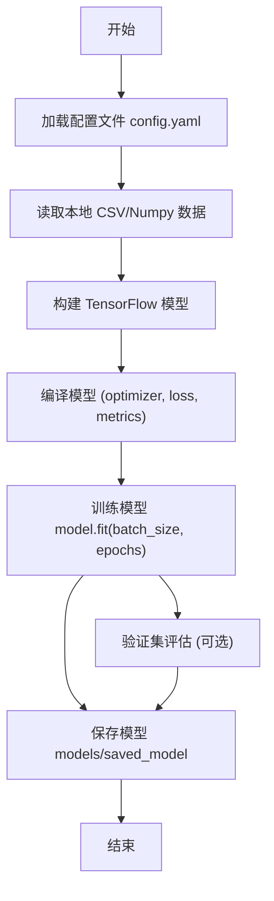
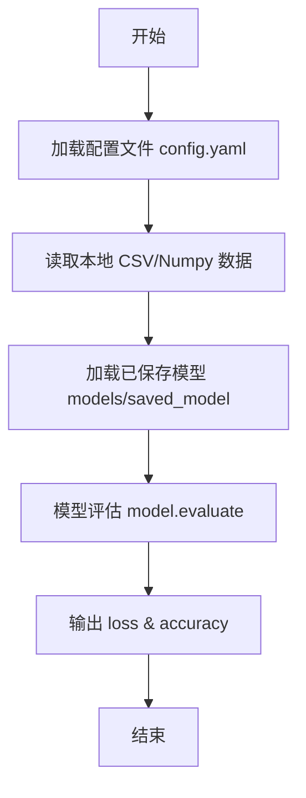
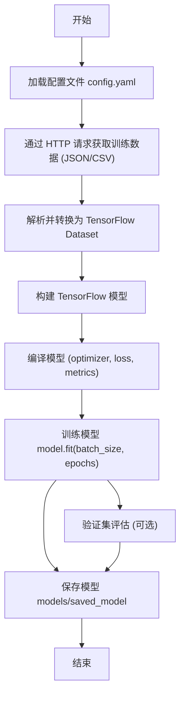
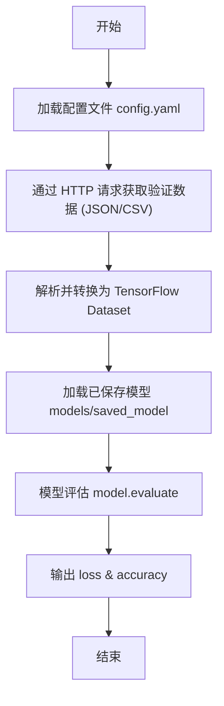

# LearnAI-TF 项目目录


# 项目目录结构

```bash
LearnAI-TF/
├── configs/                   # 配置文件目录
│   └── config_train.yaml      # 训练/评估相关的 YAML 配置
│
├── data/                      # 数据存放目录
│   ├── raw/                   # 原始数据（CSV、图片、原始文件等）
│   └── processed/             # 经过预处理或清洗后的数据
│
├── modules/                   # 项目核心功能模块统一存放
│   ├── model.py               # 模型构建逻辑（支持 TensorFlow / Keras，反射构建模型）
│   ├── dataloader.py          # 数据加载逻辑（CSV / Web / TensorFlow Dataset）
│   ├── train.py               # 训练流程（训练 + 验证 + 保存模型）
│   ├── evaluate.py            # 模型评估流程（加载训练好的模型 + 测试数据 + 指标计算）
│   ├── utils.py               # 通用工具函数（call_target、build_web_dataset、build_csv_loader、日志工具等）
│   └── deployment.py          # 部署相关脚本（AI Server 部署接口）
│
├── outputs/                   # 训练与推理输出目录
│   ├── checkpoints/           # 模型训练检查点（用于断点续训）
│   ├── onnx/                  # 导出的 ONNX 模型文件
│   └── saved_model/           # TensorFlow SavedModel 文件
│
├── tests/                     # 测试目录
│   └── test_pipeline.py       # 测试 pipeline 是否正常运行
│
├── main.py                    # 项目入口（可用于训练或启动服务）
├── requirements.txt           # Python 依赖包
└── README.md                  # 项目说明文档
```


#  主要工作流程

## 1. 本地数据训练流程



## 2. 本地数据验证流程



## 3. Web 数据训练流程



## Web 数据验证流程

