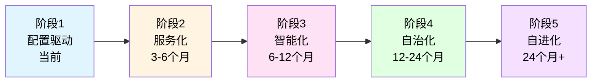
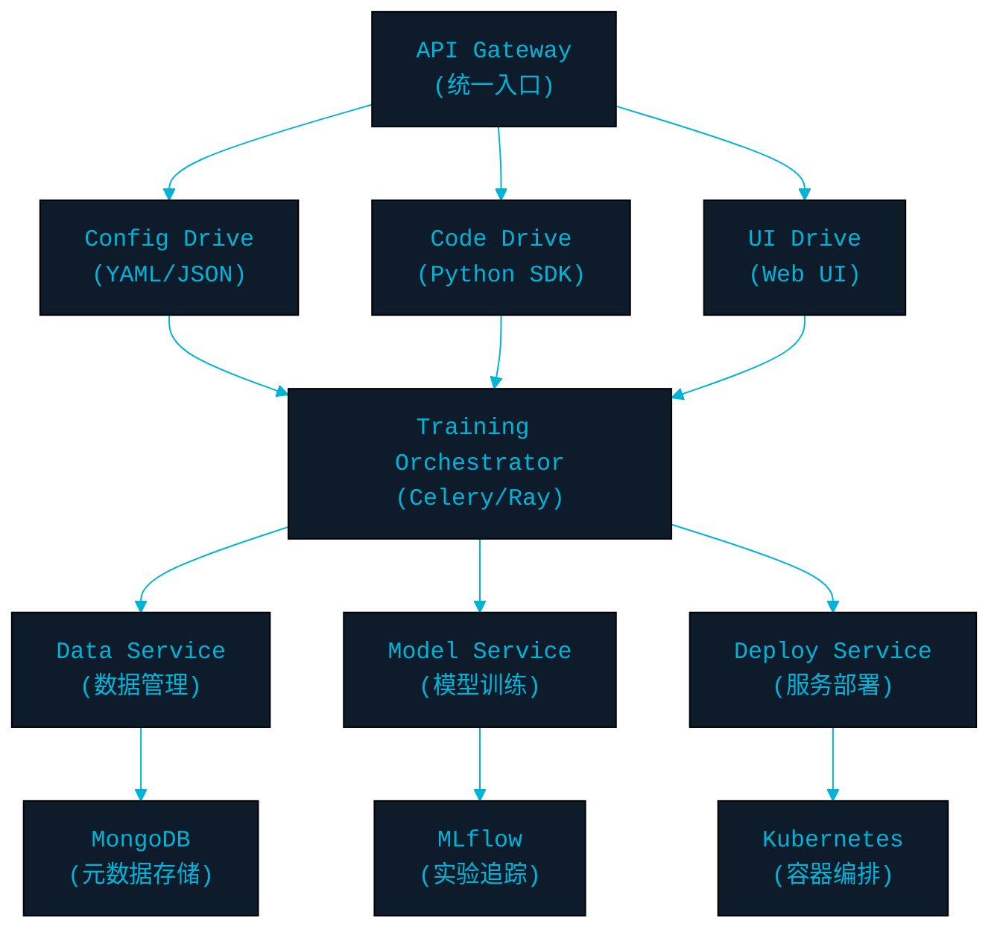
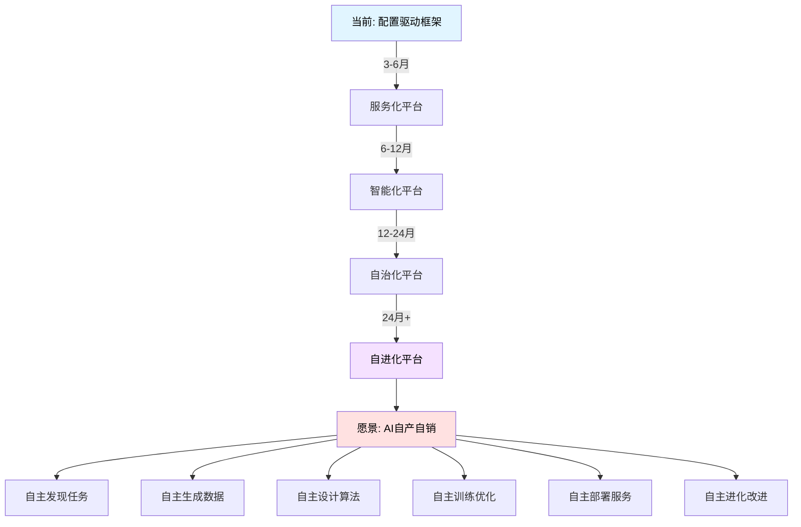

# AI驱动的自动化机器学习平台演进路线图

> **愿景：** 从配置驱动的训练框架，演进为AI自主驱动的"自产自销"智能平台
>
> **目标：** 实现从数据生成、模型训练、服务部署到持续优化的全流程自动化

---

## 📋 目录

1. [当前设计分析](#1-当前设计分析)
2. [架构演进路线图](#2-架构演进路线图)
3. [核心技术瓶颈与解决方案](#3-核心技术瓶颈与解决方案)
4. [分阶段实施计划](#4-分阶段实施计划)
5. [技术栈选型建议](#5-技术栈选型建议)

---

## 1. 当前设计分析

### 1.1 现有优势 ✅

| 优势 | 说明 | 为未来奠定的基础 |
|------|------|------------------|
| **配置驱动架构** | YAML配置灵活可扩展 | 可扩展为多模态驱动入口 |
| **模块化设计** | 数据、模型、训练分离 | 便于插件化改造 |
| **反射机制** | 动态加载组件 | 支持AI动态生成配置 |
| **硬件抽象** | CPU/GPU自适应 | 支持分布式和异构计算 |
| **训练上下文** | 统一状态管理 | 可扩展为智能调度中心 |

### 1.2 主要不足 ⚠️

#### 1.2.1 架构层面

| 问题 | 当前状态 | 影响 | 优先级 |
|------|----------|------|--------|
| **单体架构** | 所有功能在单进程 | 无法水平扩展，不支持分布式训练 | 🔴 高 |
| **同步执行** | 训练阻塞主线程 | 无法并行多任务，资源利用率低 | 🔴 高 |
| **静态配置** | 运行时无法调整 | 无法实现动态优化和自适应 | 🟡 中 |
| **缺少元数据管理** | 无实验追踪 | 难以比较实验和知识积累 | 🔴 高 |
| **硬编码逻辑** | 训练流程固定 | 无法支持AI自动设计算法 | 🟢 低 |

#### 1.2.2 数据层面

| 问题 | 当前状态 | 影响 | 优先级 |
|------|----------|------|--------|
| **数据被动加载** | 需要人工准备数据 | 无法实现自动数据生成 | 🔴 高 |
| **无数据版本管理** | 数据集无追踪 | 实验不可复现 | 🟡 中 |
| **缺少数据质量评估** | 无自动筛选 | 脏数据影响模型质量 | 🟡 中 |
| **无合成数据管道** | 不支持GAN/Diffusion生成 | 无法自产数据 | 🔴 高 |

#### 1.2.3 模型层面

| 问题 | 当前状态 | 影响 | 优先级 |
|------|----------|------|--------|
| **手动设计模型** | 需要配置网络结构 | 无法自动搜索最优架构 | 🔴 高 |
| **无模型注册中心** | 模型分散存储 | 难以管理和复用 | 🟡 中 |
| **缺少模型性能监控** | 无在线指标追踪 | 模型退化无感知 | 🟡 中 |
| **不支持持续学习** | 无增量训练 | 无法适应数据漂移 | 🟢 低 |

#### 1.2.4 服务层面

| 问题 | 当前状态 | 影响 | 优先级 |
|------|----------|------|--------|
| **无自动部署** | 手动导出和部署 | 无法快速迭代 | 🔴 高 |
| **缺少API网关** | 无统一服务入口 | 无法实现服务编排 | 🟡 中 |
| **无负载均衡** | 单实例服务 | 无法高并发 | 🟡 中 |
| **缺少A/B测试** | 无灰度发布 | 新模型风险高 | 🟢 低 |

#### 1.2.5 智能层面

| 问题 | 当前状态 | 影响 | 优先级 |
|------|----------|------|--------|
| **无自动调参** | 需要手动调超参数 | 效率低，最优解难找 | 🔴 高 |
| **无AutoML能力** | 不支持NAS/AutoML | 无法自动设计模型 | 🔴 高 |
| **缺少强化学习反馈** | 无自我优化 | 无法闭环改进 | 🟡 中 |
| **无LLM集成** | 不支持AI驱动 | 无法实现智能决策 | 🔴 高 |

---

## 2. 架构演进路线图

### 2.1 演进阶段概览



### 2.2 阶段1：配置驱动（当前）

**特征：** 人工编写配置 → 框架执行训练

```yaml
当前架构：
用户 → YAML配置 → 训练框架 → 模型输出
        ↓
    手动设计    手动调参    手动部署
```

**能力：**
- ✅ 灵活的配置系统
- ✅ 多种训练模式
- ✅ 基础硬件适配

**局限：**
- ❌ 完全依赖人工
- ❌ 无法自动优化
- ❌ 单机单任务

---

### 2.3 阶段2：服务化改造（3-6个月）

#### 目标：构建微服务架构，支持多模态驱动



#### 核心改进

##### 2.3.1 微服务拆分

```python
# 服务拆分方案
services/
├── api_gateway/              # API网关服务
│   ├── routers/
│   │   ├── config_router.py  # 配置驱动入口
│   │   ├── code_router.py    # 代码驱动入口
│   │   └── ui_router.py      # UI驱动入口
│   └── middleware/
│       ├── auth.py           # 认证
│       └── rate_limit.py     # 限流
│
├── data_service/             # 数据服务
│   ├── loader/               # 数据加载
│   ├── processor/            # 数据处理
│   ├── generator/            # 数据生成 ⭐
│   └── versioning/           # 数据版本管理
│
├── training_service/         # 训练服务
│   ├── orchestrator/         # 任务编排
│   ├── executor/             # 训练执行
│   ├── monitor/              # 监控
│   └── checkpoint/           # 检查点管理
│
├── model_service/            # 模型服务
│   ├── registry/             # 模型注册中心
│   ├── versioning/           # 版本管理
│   ├── evaluation/           # 模型评估
│   └── optimization/         # 模型优化
│
└── deployment_service/       # 部署服务
    ├── builder/              # 构建服务
    ├── deployer/             # 部署器
    ├── scaler/               # 自动扩缩容
    └── monitor/              # 服务监控
```

##### 2.3.2 任务编排系统

```python
# 使用 Celery 或 Ray 实现分布式任务调度

# tasks/training_tasks.py
from celery import Celery, group, chain
from celery.result import AsyncResult

app = Celery('ml_platform', broker='redis://localhost:6379')

@app.task(bind=True)
def train_model_task(self, config: dict):
    """训练模型任务"""
    # 更新任务状态
    self.update_state(state='TRAINING', meta={'progress': 0})

    # 执行训练
    context = create_training_context(config)
    context.register_callback('on_epoch_end',
        lambda ctx, data: self.update_state(
            state='TRAINING',
            meta={'progress': data['epoch'] / config['epochs'] * 100}
        )
    )

    result = execute_training(context)
    return result

@app.task
def preprocess_data_task(data_config: dict):
    """数据预处理任务"""
    return preprocess_pipeline(data_config)

@app.task
def evaluate_model_task(model_id: str, test_data: str):
    """模型评估任务"""
    return evaluate(model_id, test_data)

@app.task
def deploy_model_task(model_id: str, deployment_config: dict):
    """模型部署任务"""
    return deploy(model_id, deployment_config)

# 编排工作流
def complete_ml_pipeline(config: dict):
    """完整的ML流水线"""
    workflow = chain(
        preprocess_data_task.s(config['data']),
        train_model_task.s(config['training']),
        evaluate_model_task.s(config['test_data']),
        deploy_model_task.s(config['deployment'])
    )

    result = workflow.apply_async()
    return result.id
```

##### 2.3.3 多驱动模式支持

```python
# drivers/base_driver.py
from abc import ABC, abstractmethod

class ITrainingDriver(ABC):
    """训练驱动器接口"""

    @abstractmethod
    def parse_input(self, input_data: Any) -> TrainingSpec:
        """解析输入为训练规范"""
        pass

    @abstractmethod
    def submit_training(self, spec: TrainingSpec) -> TrainingJob:
        """提交训练任务"""
        pass


# drivers/config_driver.py
class ConfigDriver(ITrainingDriver):
    """配置文件驱动（当前方式）"""

    def parse_input(self, yaml_path: str) -> TrainingSpec:
        config = load_yaml(yaml_path)
        return TrainingSpec.from_dict(config)

    def submit_training(self, spec: TrainingSpec) -> TrainingJob:
        task_id = train_model_task.delay(spec.to_dict())
        return TrainingJob(task_id)


# drivers/code_driver.py
class CodeDriver(ITrainingDriver):
    """代码驱动（Python SDK）"""

    def parse_input(self, code_block: str) -> TrainingSpec:
        # 执行用户代码，提取训练规范
        namespace = {}
        exec(code_block, namespace)
        return namespace['training_spec']

    def submit_training(self, spec: TrainingSpec) -> TrainingJob:
        task_id = train_model_task.delay(spec.to_dict())
        return TrainingJob(task_id)


# drivers/ui_driver.py
class UIDriver(ITrainingDriver):
    """UI驱动（Web界面）"""

    def parse_input(self, form_data: dict) -> TrainingSpec:
        # 从表单数据构建训练规范
        return TrainingSpec(
            model_type=form_data['model_type'],
            dataset=form_data['dataset'],
            hyperparameters=form_data['hyperparameters']
        )

    def submit_training(self, spec: TrainingSpec) -> TrainingJob:
        task_id = train_model_task.delay(spec.to_dict())
        return TrainingJob(task_id)


# drivers/nlp_driver.py (为未来AI驱动做准备)
class NLPDriver(ITrainingDriver):
    """自然语言驱动"""

    def __init__(self, llm_client):
        self.llm = llm_client

    def parse_input(self, natural_language: str) -> TrainingSpec:
        # 使用LLM解析自然语言
        prompt = f"""
        用户需求: {natural_language}

        请生成训练配置JSON，包含：
        1. model_type: 模型类型
        2. dataset: 数据集
        3. hyperparameters: 超参数

        输出JSON格式。
        """

        response = self.llm.generate(prompt)
        config = json.loads(response)
        return TrainingSpec.from_dict(config)
```

##### 2.3.4 实验追踪系统

```python
# 集成 MLflow 进行实验管理
from mlflow.tracking import MlflowClient

class ExperimentTracker:
    """实验追踪器"""

    def __init__(self, tracking_uri: str):
        self.client = MlflowClient(tracking_uri)

    def create_experiment(self, name: str, tags: dict = None):
        """创建实验"""
        return self.client.create_experiment(name, tags=tags)

    def log_training_run(self, context: TrainingContext):
        """记录训练过程"""
        with mlflow.start_run():
            # 记录参数
            mlflow.log_params(context.get_config())

            # 记录模型
            for name, model in context.models.items():
                mlflow.keras.log_model(model, name)

            # 记录指标历史
            for metric, values in context.training_history.items():
                for step, value in enumerate(values):
                    mlflow.log_metric(metric, value, step=step)

            # 记录工件
            mlflow.log_artifacts(context.checkpoint_dir)
```

##### 2.3.5 RESTful API设计

```python
# api/v1/training.py
from fastapi import FastAPI, BackgroundTasks, HTTPException
from pydantic import BaseModel

app = FastAPI(title="ML Training Platform")

class TrainingRequest(BaseModel):
    """训练请求"""
    project_name: str
    model_config: dict
    data_config: dict
    training_config: dict

class TrainingResponse(BaseModel):
    """训练响应"""
    job_id: str
    status: str
    created_at: str

@app.post("/api/v1/training/submit", response_model=TrainingResponse)
async def submit_training(request: TrainingRequest):
    """提交训练任务"""
    # 验证配置
    validate_config(request)

    # 提交任务
    task = train_model_task.delay(request.dict())

    return TrainingResponse(
        job_id=task.id,
        status="PENDING",
        created_at=datetime.now().isoformat()
    )

@app.get("/api/v1/training/{job_id}/status")
async def get_training_status(job_id: str):
    """查询训练状态"""
    result = AsyncResult(job_id)

    return {
        "job_id": job_id,
        "state": result.state,
        "progress": result.info.get('progress', 0) if result.info else 0,
        "result": result.result if result.ready() else None
    }

@app.delete("/api/v1/training/{job_id}/cancel")
async def cancel_training(job_id: str):
    """取消训练任务"""
    result = AsyncResult(job_id)
    result.revoke(terminate=True)
    return {"message": "Training cancelled"}
```

---

### 2.4 阶段3：智能化（6-12个月）

#### 目标：引入AI能力，实现半自动化

```yaml
智能能力：
├── AutoML: 自动模型搜索
├── 自动调参: 贝叶斯优化/进化算法
├── 数据增强: GAN/Diffusion生成
├── 模型压缩: 自动剪枝/蒸馏
└── 智能部署: 自动选择部署策略
```

#### 3.1 AutoML集成

```python
# automl/neural_architecture_search.py
from ray import tune
from ray.tune.schedulers import ASHAScheduler

class NeuralArchitectureSearch:
    """神经网络架构搜索"""

    def __init__(self, search_space: dict):
        self.search_space = search_space

    def search(self, dataset, num_trials=100):
        """搜索最优架构"""

        def train_model(config):
            """训练单个配置"""
            model = self._build_model_from_config(config)

            for epoch in range(10):
                loss, acc = train_one_epoch(model, dataset)
                tune.report(loss=loss, accuracy=acc)

        # 配置调度器
        scheduler = ASHAScheduler(
            metric="accuracy",
            mode="max",
            max_t=100,
            grace_period=10
        )

        # 执行搜索
        analysis = tune.run(
            train_model,
            config=self.search_space,
            num_samples=num_trials,
            scheduler=scheduler,
            resources_per_trial={"gpu": 1}
        )

        best_config = analysis.get_best_config(metric="accuracy", mode="max")
        return best_config

    def _build_model_from_config(self, config):
        """根据配置构建模型"""
        model = tf.keras.Sequential()

        for i in range(config['num_layers']):
            model.add(tf.keras.layers.Dense(
                units=config[f'layer_{i}_units'],
                activation=config[f'layer_{i}_activation']
            ))

        return model


# 搜索空间定义
search_space = {
    'num_layers': tune.randint(2, 10),
    'layer_0_units': tune.choice([64, 128, 256, 512]),
    'layer_0_activation': tune.choice(['relu', 'tanh', 'elu']),
    'learning_rate': tune.loguniform(1e-4, 1e-1),
    'batch_size': tune.choice([32, 64, 128])
}

# 使用
nas = NeuralArchitectureSearch(search_space)
best_architecture = nas.search(train_dataset)
```

#### 3.2 自动超参数优化

```python
# automl/hyperparameter_tuning.py
import optuna

class HyperparameterOptimizer:
    """超参数优化器"""

    def __init__(self, objective_function):
        self.objective = objective_function

    def optimize(self, n_trials=100):
        """贝叶斯优化"""

        def objective(trial):
            # 定义超参数搜索空间
            learning_rate = trial.suggest_loguniform('lr', 1e-5, 1e-1)
            batch_size = trial.suggest_categorical('batch_size', [16, 32, 64, 128])
            optimizer_name = trial.suggest_categorical('optimizer', ['adam', 'sgd', 'rmsprop'])
            dropout_rate = trial.suggest_uniform('dropout', 0.1, 0.5)

            # 训练模型
            config = {
                'learning_rate': learning_rate,
                'batch_size': batch_size,
                'optimizer': optimizer_name,
                'dropout': dropout_rate
            }

            accuracy = self.objective(config)
            return accuracy

        # 创建研究
        study = optuna.create_study(
            direction='maximize',
            sampler=optuna.samplers.TPESampler(),
            pruner=optuna.pruners.MedianPruner()
        )

        # 执行优化
        study.optimize(objective, n_trials=n_trials)

        return study.best_params
```

#### 3.3 智能数据生成

```python
# data_generation/synthetic_data_generator.py

class SyntheticDataGenerator:
    """合成数据生成器"""

    def __init__(self, generator_type: str = "gan"):
        self.generator_type = generator_type

    def train_generator(self, real_data, epochs=100):
        """训练生成器"""
        if self.generator_type == "gan":
            self.generator = self._build_gan()
            self._train_gan(real_data, epochs)
        elif self.generator_type == "vae":
            self.generator = self._build_vae()
            self._train_vae(real_data, epochs)
        elif self.generator_type == "diffusion":
            self.generator = self._build_diffusion()
            self._train_diffusion(real_data, epochs)

    def generate_data(self, num_samples: int):
        """生成合成数据"""
        if not self.generator:
            raise ValueError("生成器未训练")

        synthetic_data = self.generator.generate(num_samples)
        return synthetic_data

    def evaluate_quality(self, real_data, synthetic_data):
        """评估生成质量"""
        # FID分数
        fid_score = self._calculate_fid(real_data, synthetic_data)

        # 隐私度量
        privacy_score = self._calculate_privacy_risk(real_data, synthetic_data)

        # 效用度量
        utility_score = self._calculate_utility(real_data, synthetic_data)

        return {
            'fid_score': fid_score,
            'privacy_score': privacy_score,
            'utility_score': utility_score
        }

    def _build_gan(self):
        """构建GAN"""
        # Generator
        generator = tf.keras.Sequential([
            tf.keras.layers.Dense(256, activation='relu', input_shape=(100,)),
            tf.keras.layers.Dense(512, activation='relu'),
            tf.keras.layers.Dense(784, activation='sigmoid')
        ])

        # Discriminator
        discriminator = tf.keras.Sequential([
            tf.keras.layers.Dense(512, activation='relu', input_shape=(784,)),
            tf.keras.layers.Dense(256, activation='relu'),
            tf.keras.layers.Dense(1, activation='sigmoid')
        ])

        return GANModel(generator, discriminator)
```

---

### 2.5 阶段4：自治化（12-24个月）

#### 目标：AI驱动决策，系统自主运行

```yaml
自治能力：
├── LLM驱动配置生成
├── 强化学习自动调优
├── 自主故障恢复
├── 智能资源调度
└── 持续学习与进化
```

#### 4.1 LLM驱动的配置生成

```python
# ai_driver/llm_config_generator.py
from langchain.llms import OpenAI
from langchain.prompts import PromptTemplate
from langchain.chains import LLMChain

class LLMConfigGenerator:
    """LLM驱动的配置生成器"""

    def __init__(self, llm_model="gpt-4"):
        self.llm = OpenAI(model=llm_model, temperature=0.3)
        self.prompt_template = self._create_prompt_template()

    def generate_config_from_description(self, user_description: str) -> dict:
        """从自然语言描述生成配置"""

        chain = LLMChain(llm=self.llm, prompt=self.prompt_template)

        response = chain.run(user_description=user_description)
        config = self._parse_llm_response(response)

        # 验证配置
        if not self._validate_config(config):
            # 让LLM修正
            config = self._refine_config(config, user_description)

        return config

    def _create_prompt_template(self):
        """创建提示模板"""
        template = """
        你是一个机器学习专家。用户描述了一个训练任务，请生成完整的训练配置。

        用户描述：
        {user_description}

        请生成YAML格式的训练配置，包含：
        1. 模型架构（根据任务类型选择合适的模型）
        2. 数据处理流程
        3. 训练超参数
        4. 优化器配置
        5. 评估指标

        要求：
        - 配置必须完整可执行
        - 选择最佳实践的超参数
        - 考虑任务的特点

        输出YAML：
        ```yaml
        """

        return PromptTemplate(
            input_variables=["user_description"],
            template=template
        )

    def suggest_improvements(self, current_config: dict, training_results: dict) -> dict:
        """根据训练结果建议改进"""

        prompt = f"""
        当前配置：
        {yaml.dump(current_config)}

        训练结果：
        - 最终损失: {training_results['final_loss']}
        - 最佳准确率: {training_results['best_accuracy']}
        - 训练时长: {training_results['duration']}
        - 问题: {training_results.get('issues', '无')}

        请分析结果并建议配置改进，输出改进后的YAML配置。
        """

        response = self.llm.generate(prompt)
        improved_config = self._parse_llm_response(response)

        return improved_config


# 使用示例
generator = LLMConfigGenerator()

# 用户用自然语言描述需求
user_request = """
我想训练一个图像分类模型，识别猫和狗。
我有10000张图片，标注好的。
希望模型准确率达到95%以上，训练时间不超过2小时。
我有一张RTX 4090 GPU。
"""

# AI生成配置
config = generator.generate_config_from_description(user_request)

# 自动提交训练
training_job = submit_training(config)

# 训练完成后，AI分析结果并建议改进
results = get_training_results(training_job.id)
improved_config = generator.suggest_improvements(config, results)
```

#### 4.2 强化学习自动调优

```python
# ai_optimizer/rl_hyperparameter_tuner.py
import gym
from stable_baselines3 import PPO

class RLHyperparameterTuner:
    """基于强化学习的超参数调优"""

    def __init__(self):
        self.env = self._create_tuning_environment()
        self.agent = PPO("MlpPolicy", self.env, verbose=1)

    def _create_tuning_environment(self):
        """创建调参环境"""

        class HyperparameterEnv(gym.Env):
            """超参数调优环境"""

            def __init__(self):
                super().__init__()

                # 动作空间：调整超参数的方向和幅度
                self.action_space = gym.spaces.Box(
                    low=-1, high=1, shape=(5,), dtype=np.float32
                )
                # [学习率调整, batch_size调整, dropout调整, 层数调整, 单元数调整]

                # 状态空间：当前超参数 + 训练指标
                self.observation_space = gym.spaces.Box(
                    low=0, high=1, shape=(10,), dtype=np.float32
                )

                self.current_config = self._init_config()
                self.training_history = []

            def step(self, action):
                """执行动作：调整超参数"""
                # 应用动作到超参数
                new_config = self._apply_action(self.current_config, action)

                # 训练模型并评估
                metrics = self._train_and_evaluate(new_config)

                # 计算奖励
                reward = self._calculate_reward(metrics)

                # 更新状态
                self.current_config = new_config
                self.training_history.append(metrics)

                # 判断是否结束
                done = self._check_convergence()

                observation = self._get_observation()

                return observation, reward, done, {}

            def _calculate_reward(self, metrics):
                """计算奖励"""
                # 多目标奖励
                accuracy_reward = metrics['accuracy'] * 10
                speed_reward = -metrics['training_time'] / 3600  # 小时
                efficiency_reward = metrics['accuracy'] / metrics['training_time']

                # 惩罚过拟合
                overfitting_penalty = 0
                if metrics['train_acc'] - metrics['val_acc'] > 0.1:
                    overfitting_penalty = -5

                total_reward = (
                    accuracy_reward +
                    speed_reward * 0.5 +
                    efficiency_reward * 2 +
                    overfitting_penalty
                )

                return total_reward

            def _train_and_evaluate(self, config):
                """训练并评估配置"""
                # 提交训练任务
                job = submit_training_job(config)

                # 等待完成
                results = wait_for_completion(job.id)

                return {
                    'accuracy': results['val_accuracy'],
                    'train_acc': results['train_accuracy'],
                    'val_acc': results['val_accuracy'],
                    'training_time': results['duration'],
                    'loss': results['final_loss']
                }

        return HyperparameterEnv()

    def tune(self, total_timesteps=10000):
        """执行调优"""
        # 训练RL代理
        self.agent.learn(total_timesteps=total_timesteps)

        # 获取最优配置
        best_config = self._extract_best_config()

        return best_config

    def _extract_best_config(self):
        """提取最优配置"""
        # 从训练历史中选择最佳
        best_episode = max(
            self.env.training_history,
            key=lambda x: x['accuracy']
        )
        return best_episode['config']
```

#### 4.3 自主故障恢复

```python
# autonomous/fault_recovery.py

class AutonomousFaultRecovery:
    """自主故障恢复系统"""

    def __init__(self, llm_client):
        self.llm = llm_client
        self.error_knowledge_base = ErrorKnowledgeBase()

    def monitor_training(self, job_id: str):
        """监控训练并自动恢复"""

        while True:
            status = get_training_status(job_id)

            # 检测异常
            if self._detect_anomaly(status):
                # 诊断问题
                diagnosis = self._diagnose_issue(status)

                # 生成解决方案
                solution = self._generate_solution(diagnosis)

                # 自动修复
                if solution['auto_fixable']:
                    self._apply_fix(job_id, solution)
                    logger.info(f"自动修复完成: {solution['description']}")
                else:
                    # 通知人工介入
                    self._notify_human(diagnosis, solution)

            time.sleep(60)  # 每分钟检查一次

    def _detect_anomaly(self, status):
        """检测异常"""
        anomalies = []

        # 检查训练停滞
        if self._is_training_stuck(status):
            anomalies.append('training_stuck')

        # 检查梯度爆炸
        if self._has_gradient_explosion(status):
            anomalies.append('gradient_explosion')

        # 检查过拟合
        if self._is_overfitting(status):
            anomalies.append('overfitting')

        # 检查资源不足
        if self._insufficient_resources(status):
            anomalies.append('oom')

        return anomalies

    def _diagnose_issue(self, status):
        """使用LLM诊断问题"""

        prompt = f"""
        训练任务出现异常，请诊断问题原因。

        状态信息：
        - 当前Epoch: {status['epoch']}
        - 当前损失: {status['current_loss']}
        - 损失趋势: {status['loss_history'][-10:]}
        - 梯度范数: {status.get('gradient_norm', 'N/A')}
        - 内存使用: {status['memory_usage']}
        - GPU利用率: {status['gpu_utilization']}

        异常现象:
        {', '.join(status['anomalies'])}

        请分析可能的原因并建议解决方案。
        """

        diagnosis = self.llm.generate(prompt)
        return self._parse_diagnosis(diagnosis)

    def _generate_solution(self, diagnosis):
        """生成解决方案"""

        # 查询知识库
        known_solutions = self.error_knowledge_base.search(diagnosis['issue_type'])

        if known_solutions:
            return known_solutions[0]  # 返回最佳已知方案

        # 使用LLM生成新方案
        prompt = f"""
        问题诊断：{diagnosis['description']}
        根本原因：{diagnosis['root_cause']}

        请生成可执行的修复方案，包括：
        1. 是否可自动修复
        2. 修复步骤
        3. 需要调整的配置
        4. 预期效果

        输出JSON格式。
        """

        solution = self.llm.generate(prompt)
        return json.loads(solution)

    def _apply_fix(self, job_id: str, solution: dict):
        """应用修复方案"""

        # 暂停训练
        pause_training(job_id)

        # 应用配置调整
        if 'config_changes' in solution:
            update_training_config(job_id, solution['config_changes'])

        # 从检查点恢复
        if solution.get('rollback_checkpoint'):
            rollback_to_checkpoint(job_id, solution['checkpoint'])

        # 恢复训练
        resume_training(job_id)

        # 记录到知识库
        self.error_knowledge_base.add(solution)
```

#### 4.4 智能资源调度

```python
# autonomous/resource_scheduler.py

class IntelligentResourceScheduler:
    """智能资源调度器"""

    def __init__(self):
        self.cluster_manager = KubernetesManager()
        self.predictor = ResourcePredictor()

    def schedule_training_job(self, job_spec: dict):
        """智能调度训练任务"""

        # 预测资源需求
        predicted_resources = self.predictor.predict_requirements(job_spec)

        # 分析集群状态
        cluster_state = self.cluster_manager.get_cluster_state()

        # 决策调度策略
        strategy = self._decide_scheduling_strategy(
            job_spec,
            predicted_resources,
            cluster_state
        )

        # 执行调度
        if strategy['type'] == 'immediate':
            return self._schedule_immediately(job_spec, strategy)
        elif strategy['type'] == 'queue':
            return self._add_to_queue(job_spec, strategy)
        elif strategy['type'] == 'preempt':
            return self._preemptive_schedule(job_spec, strategy)

    def _decide_scheduling_strategy(self, job_spec, resources, cluster_state):
        """决策调度策略"""

        # 计算优先级
        priority = self._calculate_priority(job_spec)

        # 检查资源可用性
        if self._has_sufficient_resources(resources, cluster_state):
            return {'type': 'immediate', 'resources': resources}

        # 资源不足，判断是否抢占
        if priority > 0.8:  # 高优先级
            return {'type': 'preempt', 'resources': resources}

        # 加入队列
        return {'type': 'queue', 'estimated_wait': self._estimate_wait_time()}

    def optimize_resource_allocation(self):
        """持续优化资源分配"""

        while True:
            # 获取所有运行中的任务
            running_jobs = self.cluster_manager.list_running_jobs()

            # 分析资源使用效率
            for job in running_jobs:
                efficiency = self._analyze_efficiency(job)

                # 低效任务：减少资源
                if efficiency < 0.5:
                    self._scale_down(job)

                # 高负载任务：增加资源
                if efficiency > 0.9:
                    self._scale_up(job)

            time.sleep(300)  # 每5分钟优化一次


class ResourcePredictor:
    """资源需求预测器"""

    def __init__(self):
        self.predictor_model = self._load_predictor_model()

    def predict_requirements(self, job_spec: dict):
        """预测任务资源需求"""

        features = self._extract_features(job_spec)

        # 使用ML模型预测
        predictions = self.predictor_model.predict(features)

        return {
            'cpu': int(predictions[0]),
            'memory_gb': int(predictions[1]),
            'gpu': int(predictions[2]),
            'estimated_duration': int(predictions[3]),  # 分钟
            'confidence': float(predictions[4])
        }

    def _extract_features(self, job_spec):
        """提取特征"""
        return np.array([
            job_spec['model_params'],      # 模型参数量
            job_spec['dataset_size'],       # 数据集大小
            job_spec['batch_size'],         # 批次大小
            job_spec['num_epochs'],         # 训练轮数
            job_spec['model_complexity']    # 模型复杂度
        ]).reshape(1, -1)
```

---

### 2.6 阶段5：自进化（24个月+）

#### 目标：完全自主的"自产自销"系统

```yaml
终极能力：
├── 自主发现任务
├── 自主生成数据
├── 自主设计算法
├── 自主训练优化
├── 自主部署服务
└── 自主进化改进
```

#### 5.1 闭环自进化系统

```python
# evolution/self_evolution_system.py

class SelfEvolutionSystem:
    """自进化系统"""

    def __init__(self):
        self.task_discoverer = TaskDiscoverer()
        self.data_generator = AutonomousDataGenerator()
        self.algorithm_designer = AlgorithmDesigner()
        self.training_orchestrator = AutoTrainingOrchestrator()
        self.deployment_engine = AutoDeploymentEngine()
        self.performance_analyzer = PerformanceAnalyzer()

    def run_evolution_cycle(self):
        """运行一个完整的进化周期"""

        logger.info("=" * 60)
        logger.info("开始新的进化周期")
        logger.info("=" * 60)

        # 1. 发现新任务
        new_tasks = self.task_discoverer.discover_tasks()
        logger.info(f"发现 {len(new_tasks)} 个新任务")

        for task in new_tasks:
            # 2. 生成训练数据
            dataset = self.data_generator.generate_for_task(task)
            logger.info(f"为任务 {task.name} 生成了 {len(dataset)} 条数据")

            # 3. 设计算法
            algorithm = self.algorithm_designer.design_for_task(task, dataset)
            logger.info(f"为任务 {task.name} 设计了算法: {algorithm.name}")

            # 4. 自主训练
            trained_model = self.training_orchestrator.train(algorithm, dataset)
            logger.info(f"训练完成，性能: {trained_model.metrics}")

            # 5. 自动部署
            service = self.deployment_engine.deploy(trained_model)
            logger.info(f"服务已部署: {service.url}")

            # 6. 性能监控和反馈
            performance = self.performance_analyzer.monitor(service)

            # 7. 根据反馈进化
            if performance['needs_improvement']:
                self._evolve_system(task, performance)


class TaskDiscoverer:
    """任务发现器：从环境中自主发现新任务"""

    def __init__(self, llm_client):
        self.llm = llm_client
        self.market_analyzer = MarketAnalyzer()
        self.user_behavior_analyzer = UserBehaviorAnalyzer()

    def discover_tasks(self):
        """发现新的机器学习任务"""

        discovered_tasks = []

        # 1. 分析市场需求
        market_trends = self.market_analyzer.analyze_trends()

        # 2. 分析用户行为
        user_needs = self.user_behavior_analyzer.extract_needs()

        # 3. 使用LLM识别潜在任务
        prompt = f"""
        市场趋势分析：
        {json.dumps(market_trends, indent=2)}

        用户需求分析：
        {json.dumps(user_needs, indent=2)}

        基于以上信息，识别可以通过机器学习解决的潜在任务。
        对每个任务，输出：
        1. 任务名称
        2. 任务描述
        3. 预期价值
        4. 所需数据类型
        5. 难度评估

        输出JSON格式的任务列表。
        """

        response = self.llm.generate(prompt)
        tasks = json.loads(response)

        # 4. 验证任务可行性
        for task in tasks:
            if self._validate_task_feasibility(task):
                discovered_tasks.append(MLTask.from_dict(task))

        return discovered_tasks


class AutonomousDataGenerator:
    """自主数据生成器"""

    def __init__(self):
        self.synthesis_models = {}  # 不同类型数据的生成模型

    def generate_for_task(self, task: MLTask):
        """为特定任务生成数据"""

        # 1. 分析任务需要什么样的数据
        data_spec = self._analyze_data_requirements(task)

        # 2. 选择或训练生成模型
        if data_spec.type in self.synthesis_models:
            generator = self.synthesis_models[data_spec.type]
        else:
            # 从零开始训练新的生成器
            generator = self._bootstrap_generator(data_spec)
            self.synthesis_models[data_spec.type] = generator

        # 3. 生成数据
        synthetic_data = generator.generate(data_spec.num_samples)

        # 4. 质量验证
        if not self._validate_data_quality(synthetic_data, data_spec):
            # 改进生成器
            generator = self._improve_generator(generator, data_spec)
            synthetic_data = generator.generate(data_spec.num_samples)

        return synthetic_data

    def _bootstrap_generator(self, data_spec):
        """冷启动：从少量种子数据训练生成器"""

        # 1. 收集少量真实样本（爬虫/API/人工标注）
        seed_data = self._collect_seed_data(data_spec, num_samples=100)

        # 2. 训练初始生成器
        if data_spec.modality == 'image':
            generator = self._train_image_generator(seed_data)
        elif data_spec.modality == 'text':
            generator = self._train_text_generator(seed_data)
        elif data_spec.modality == 'tabular':
            generator = self._train_tabular_generator(seed_data)

        return generator


class AlgorithmDesigner:
    """算法设计器：自主设计机器学习算法"""

    def __init__(self, llm_client):
        self.llm = llm_client
        self.algorithm_templates = self._load_algorithm_templates()

    def design_for_task(self, task: MLTask, dataset):
        """为任务设计算法"""

        # 1. 分析任务特征
        task_features = self._analyze_task(task, dataset)

        # 2. 搜索相似任务
        similar_tasks = self._find_similar_tasks(task_features)

        # 3. 使用LLM设计新算法
        algorithm_code = self._generate_algorithm_code(task, similar_tasks)

        # 4. 编译并验证
        algorithm = self._compile_and_validate(algorithm_code)

        return algorithm

    def _generate_algorithm_code(self, task, similar_tasks):
        """使用LLM生成算法代码"""

        prompt = f"""
        你是一个算法专家。请为以下任务设计一个创新的机器学习算法。

        任务描述：{task.description}
        数据特征：{task.data_features}

        类似任务及其解决方案：
        {self._format_similar_tasks(similar_tasks)}

        请设计一个新算法，要求：
        1. 针对任务特点优化
        2. 借鉴但不完全复制现有方案
        3. 考虑计算效率
        4. 输出完整的Python代码（TensorFlow/PyTorch）

        代码应包含：
        - 模型定义
        - 训练循环
        - 评估函数
        """

        algorithm_code = self.llm.generate(prompt)
        return algorithm_code


class AutoDeploymentEngine:
    """自动部署引擎"""

    def deploy(self, trained_model):
        """自动将模型部署为服务"""

        # 1. 选择部署策略
        strategy = self._select_deployment_strategy(trained_model)

        # 2. 生成服务代码
        service_code = self._generate_service_code(trained_model)

        # 3. 容器化
        container_image = self._build_container(trained_model, service_code)

        # 4. 部署到集群
        service_url = self._deploy_to_cluster(container_image, strategy)

        # 5. 配置监控
        self._setup_monitoring(service_url)

        return DeployedService(
            model_id=trained_model.id,
            url=service_url,
            strategy=strategy
        )

    def _generate_service_code(self, model):
        """自动生成服务代码"""

        # 使用模板生成FastAPI服务
        template = """
from fastapi import FastAPI
import tensorflow as tf

app = FastAPI()
model = tf.keras.models.load_model('model.keras')

@app.post("/predict")
async def predict(data: dict):
    input_data = preprocess(data)
    prediction = model.predict(input_data)
    return postprocess(prediction)
"""

        # 根据模型特征定制
        customized_code = self._customize_template(template, model)

        return customized_code
```

#### 5.2 元学习系统

```python
# evolution/meta_learning.py

class MetaLearningSystem:
    """元学习系统：学习如何学习"""

    def __init__(self):
        self.experience_database = ExperienceDatabase()
        self.meta_model = self._build_meta_model()

    def learn_from_experience(self):
        """从历史经验中学习"""

        # 1. 收集所有历史训练经验
        experiences = self.experience_database.get_all_experiences()

        # 2. 提取元特征
        meta_features = []
        meta_targets = []

        for exp in experiences:
            features = self._extract_meta_features(exp)
            target = exp.final_performance

            meta_features.append(features)
            meta_targets.append(target)

        # 3. 训练元模型
        self.meta_model.fit(meta_features, meta_targets)

        # 4. 发现规律
        insights = self._discover_patterns(experiences)

        return insights

    def predict_best_configuration(self, task: MLTask):
        """预测最佳配置"""

        # 提取任务的元特征
        task_features = self._extract_task_features(task)

        # 使用元模型预测
        predicted_config = self.meta_model.predict(task_features)

        return predicted_config

    def _discover_patterns(self, experiences):
        """发现通用规律"""

        insights = {
            'best_practices': [],
            'common_pitfalls': [],
            'optimization_rules': []
        }

        # 分析成功案例的共性
        successful_cases = [e for e in experiences if e.success]
        insights['best_practices'] = self._analyze_commonalities(successful_cases)

        # 分析失败案例的共性
        failed_cases = [e for e in experiences if not e.success]
        insights['common_pitfalls'] = self._analyze_commonalities(failed_cases)

        # 提取优化规则
        insights['optimization_rules'] = self._extract_optimization_rules(experiences)

        return insights
```

---

## 3. 核心技术瓶颈与解决方案

### 3.1 技术瓶颈清单

| 编号 | 瓶颈 | 难度 | 影响范围 | 优先级 |
|------|------|------|----------|--------|
| **B1** | AI生成的配置不可靠 | ⭐⭐⭐⭐⭐ | 自主化 | 🔴 |
| **B2** | 合成数据质量不足 | ⭐⭐⭐⭐ | 数据生成 | 🔴 |
| **B3** | AutoML计算成本高 | ⭐⭐⭐⭐ | 智能化 | 🔴 |
| **B4** | 分布式训练同步困难 | ⭐⭐⭐ | 服务化 | 🟡 |
| **B5** | 模型漂移检测滞后 | ⭐⭐⭐ | 服务化 | 🟡 |
| **B6** | 冷启动问题 | ⭐⭐⭐⭐ | 自进化 | 🔴 |
| **B7** | 算法创新天花板 | ⭐⭐⭐⭐⭐ | 自进化 | 🔴 |
| **B8** | 安全和可控性 | ⭐⭐⭐⭐ | 全流程 | 🔴 |

### 3.2 详细解决方案

#### B1: AI生成配置不可靠

**问题描述：**
- LLM生成的配置可能不完整、不合法或性能差
- 缺乏验证机制

**解决方案：**

```python
# validation/config_validator.py

class AIGeneratedConfigValidator:
    """AI生成配置验证器"""

    def __init__(self):
        self.schema_validator = SchemaValidator()
        self.simulator = ConfigSimulator()
        self.critic_model = CriticModel()

    def validate_and_refine(self, config: dict, max_iterations=5):
        """验证并优化配置"""

        for iteration in range(max_iterations):
            # 1. Schema验证
            schema_errors = self.schema_validator.validate(config)
            if schema_errors:
                config = self._fix_schema_errors(config, schema_errors)
                continue

            # 2. 逻辑验证
            logic_errors = self._validate_logic(config)
            if logic_errors:
                config = self._fix_logic_errors(config, logic_errors)
                continue

            # 3. 性能预测
            predicted_performance = self.simulator.predict(config)
            if predicted_performance < 0.7:  # 阈值
                config = self._optimize_config(config)
                continue

            # 4. 使用Critic模型评分
            score = self.critic_model.score(config)
            if score < 0.8:
                suggestions = self.critic_model.suggest_improvements(config)
                config = self._apply_suggestions(config, suggestions)
                continue

            # 验证通过
            break

        return config, self._get_confidence_score(config)

    def _validate_logic(self, config):
        """逻辑验证"""
        errors = []

        # 检查超参数合理性
        if config['batch_size'] > config['dataset_size']:
            errors.append("batch_size大于dataset_size")

        # 检查模型架构合理性
        if config['model_type'] == 'cnn' and config['input_shape'] != 'image':
            errors.append("CNN模型需要图像输入")

        # 检查资源需求
        estimated_memory = self._estimate_memory(config)
        if estimated_memory > config.get('max_memory', float('inf')):
            errors.append(f"预计内存{estimated_memory}GB超过限制")

        return errors


class CriticModel:
    """配置评分模型（从历史经验学习）"""

    def __init__(self):
        self.model = self._train_critic()

    def score(self, config: dict) -> float:
        """评分配置质量 (0-1)"""
        features = self._extract_features(config)
        score = self.model.predict(features)[0]
        return float(score)

    def suggest_improvements(self, config: dict) -> List[dict]:
        """建议改进"""
        # 使用梯度分析找到改进方向
        suggestions = []

        # 对每个超参数计算敏感度
        for param in config.keys():
            sensitivity = self._compute_sensitivity(config, param)
            if sensitivity > 0.1:
                suggestions.append({
                    'parameter': param,
                    'current_value': config[param],
                    'suggested_value': self._suggest_value(config, param),
                    'expected_improvement': sensitivity
                })

        return sorted(suggestions, key=lambda x: x['expected_improvement'], reverse=True)
```

#### B2: 合成数据质量不足

**问题描述：**
- GAN/Diffusion生成的数据可能不真实
- 影响模型训练效果
- 难以评估质量

**解决方案：**

```python
# data_quality/synthetic_data_quality_control.py

class SyntheticDataQualityController:
    """合成数据质量控制"""

    def __init__(self):
        self.quality_metrics = {
            'fidelity': FidelityEvaluator(),      # 保真度
            'diversity': DiversityEvaluator(),    # 多样性
            'utility': UtilityEvaluator(),        # 效用性
            'privacy': PrivacyEvaluator()         # 隐私保护
        }
        self.quality_threshold = 0.8

    def evaluate_and_filter(self, synthetic_data, reference_data):
        """评估并过滤合成数据"""

        scores = {}

        # 1. 全面评估
        for metric_name, evaluator in self.quality_metrics.items():
            score = evaluator.evaluate(synthetic_data, reference_data)
            scores[metric_name] = score
            logger.info(f"{metric_name}: {score:.3f}")

        # 2. 综合评分
        overall_score = self._compute_overall_score(scores)

        # 3. 如果质量不足，迭代改进
        if overall_score < self.quality_threshold:
            synthetic_data = self._improve_quality(
                synthetic_data,
                reference_data,
                scores
            )

        # 4. 样本级过滤
        filtered_data = self._filter_low_quality_samples(synthetic_data)

        return filtered_data, scores

    def _improve_quality(self, synthetic_data, reference_data, scores):
        """改进生成质量"""

        # 分析弱项
        weak_aspects = [k for k, v in scores.items() if v < 0.7]

        for aspect in weak_aspects:
            if aspect == 'fidelity':
                # 增加判别器训练
                synthetic_data = self._enhance_fidelity(synthetic_data, reference_data)

            elif aspect == 'diversity':
                # 增加噪声多样性
                synthetic_data = self._enhance_diversity(synthetic_data)

            elif aspect == 'utility':
                # 针对下游任务优化
                synthetic_data = self._enhance_utility(synthetic_data, reference_data)

        return synthetic_data


class FidelityEvaluator:
    """保真度评估器"""

    def evaluate(self, synthetic_data, real_data):
        """使用FID (Fréchet Inception Distance)"""

        # 1. 提取特征
        real_features = self._extract_features(real_data)
        synthetic_features = self._extract_features(synthetic_data)

        # 2. 计算FID
        fid_score = self._calculate_fid(real_features, synthetic_features)

        # 3. 转换为0-1分数（FID越低越好）
        normalized_score = 1 / (1 + fid_score / 100)

        return normalized_score


class UtilityEvaluator:
    """效用性评估：在合成数据上训练的模型在真实数据上的表现"""

    def evaluate(self, synthetic_data, real_test_data):
        """Train on Synthetic, Test on Real (TSTR)"""

        # 1. 在合成数据上训练模型
        model = self._train_simple_model(synthetic_data)

        # 2. 在真实测试集上评估
        accuracy = self._evaluate_model(model, real_test_data)

        # 3. 比较基线（在真实数据上训练）
        baseline_model = self._train_simple_model(real_test_data)
        baseline_accuracy = self._evaluate_model(baseline_model, real_test_data)

        # 4. 计算效用分数
        utility_score = accuracy / baseline_accuracy

        return min(utility_score, 1.0)


# 主动学习式数据生成
class ActiveDataGenerator:
    """主动学习数据生成器"""

    def __init__(self, generator, discriminator):
        self.generator = generator
        self.discriminator = discriminator

    def generate_with_active_learning(self, target_quality=0.9, max_iterations=100):
        """主动学习生成高质量数据"""

        generated_data = []

        for iteration in range(max_iterations):
            # 1. 生成候选数据
            candidates = self.generator.generate(batch_size=1000)

            # 2. 判别器打分
            quality_scores = self.discriminator.score(candidates)

            # 3. 选择高质量样本
            high_quality_indices = quality_scores > target_quality
            selected_data = candidates[high_quality_indices]

            generated_data.extend(selected_data)

            # 4. 如果生成率低，调整生成器
            if len(selected_data) / len(candidates) < 0.1:
                self._fine_tune_generator(candidates, quality_scores)

            if len(generated_data) >= 10000:  # 目标数量
                break

        return np.array(generated_data)
```

#### B3: AutoML计算成本高

**问题描述：**
- NAS需要训练大量候选模型
- 资源消耗巨大
- 搜索时间长

**解决方案：**

```python
# automl/efficient_nas.py

class EfficientNAS:
    """高效神经架构搜索"""

    def __init__(self):
        self.supernet = self._build_supernet()  # 超网络
        self.predictor = PerformancePredictor()  # 性能预测器
        self.search_strategy = EvolutionarySearch()

    def search(self, dataset, search_budget=100):
        """高效搜索（减少90%计算量）"""

        # 1. 权重共享：训练超网络
        logger.info("训练超网络...")
        self._train_supernet(dataset, epochs=50)

        # 2. 性能预测器：快速评估候选
        logger.info("训练性能预测器...")
        self._train_performance_predictor(dataset)

        # 3. 进化搜索 + 预测器
        logger.info("搜索最优架构...")
        best_architecture = None
        best_score = -float('inf')

        population = self._initialize_population(size=50)

        for generation in range(search_budget // 10):
            # 使用预测器快速筛选
            predicted_scores = [
                self.predictor.predict(arch)
                for arch in population
            ]

            # 只对top-K进行真实评估
            top_k_indices = np.argsort(predicted_scores)[-10:]

            for idx in top_k_indices:
                arch = population[idx]
                # 从超网络提取子网络，快速评估
                real_score = self._evaluate_subnet(arch, dataset)

                if real_score > best_score:
                    best_score = real_score
                    best_architecture = arch

            # 进化：交叉、变异
            population = self.search_strategy.evolve(
                population,
                predicted_scores
            )

        return best_architecture


class PerformancePredictor:
    """架构性能预测器（无需训练即可预测）"""

    def __init__(self):
        self.model = self._build_predictor()

    def predict(self, architecture):
        """预测架构性能"""
        # 提取架构特征
        features = self._extract_architecture_features(architecture)

        # 预测
        predicted_accuracy = self.model.predict(features)

        return float(predicted_accuracy)

    def _extract_architecture_features(self, arch):
        """提取架构特征"""
        return np.array([
            arch['num_layers'],
            arch['total_params'],
            arch['avg_layer_width'],
            arch['num_skip_connections'],
            self._compute_graph_complexity(arch)
        ])


# 早停策略
class EarlyStoppingNAS:
    """早停NAS：快速淘汰低性能架构"""

    def __init__(self, patience=3):
        self.patience = patience

    def should_stop(self, architecture, current_epoch, history):
        """判断是否应该早停"""

        # 如果前几个epoch表现很差，直接停止
        if current_epoch >= self.patience:
            recent_performance = history[-self.patience:]

            # 计算改进率
            improvement_rate = (
                recent_performance[-1] - recent_performance[0]
            ) / self.patience

            # 如果几乎没有改进，停止
            if improvement_rate < 0.001:
                return True

        return False
```

#### B4: 分布式训练同步困难

**问题描述：**
- 多GPU/多节点训练同步开销大
- 通信瓶颈
- 负载不均衡

**解决方案：**

```python
# distributed/efficient_distributed_training.py

class EfficientDistributedTrainer:
    """高效分布式训练器"""

    def __init__(self, strategy='horovod'):
        self.strategy = self._create_strategy(strategy)
        self.gradient_compression = GradientCompression()
        self.load_balancer = DynamicLoadBalancer()

    def _create_strategy(self, strategy_name):
        """创建分布式策略"""

        if strategy_name == 'horovod':
            import horovod.tensorflow as hvd
            hvd.init()
            return HorovodStrategy()

        elif strategy_name == 'mirrored':
            return tf.distribute.MirroredStrategy()

        elif strategy_name == 'parameter_server':
            return tf.distribute.experimental.ParameterServerStrategy()

        elif strategy_name == 'custom':
            return CustomDistributedStrategy()

    def train_distributed(self, model, dataset, config):
        """分布式训练"""

        with self.strategy.scope():
            # 1. 模型并行化
            distributed_model = self._parallelize_model(model)

            # 2. 数据分片
            per_replica_dataset = self.strategy.experimental_distribute_dataset(
                dataset
            )

            # 3. 训练循环
            for epoch in range(config['epochs']):
                epoch_loss = 0

                for step, batch in enumerate(per_replica_dataset):
                    # 分布式训练步
                    loss = self._distributed_train_step(
                        distributed_model,
                        batch
                    )

                    epoch_loss += loss

                logger.info(f"Epoch {epoch}: loss={epoch_loss}")

    @tf.function
    def _distributed_train_step(self, model, batch):
        """分布式训练步"""

        def step_fn(inputs):
            features, labels = inputs

            with tf.GradientTape() as tape:
                predictions = model(features, training=True)
                loss = self._compute_loss(labels, predictions)

            # 梯度计算
            gradients = tape.gradient(loss, model.trainable_variables)

            # 梯度压缩（减少通信量）
            compressed_gradients = self.gradient_compression.compress(gradients)

            # 应用梯度
            self.optimizer.apply_gradients(
                zip(compressed_gradients, model.trainable_variables)
            )

            return loss

        # 在所有副本上执行
        per_replica_losses = self.strategy.run(step_fn, args=(batch,))

        # 聚合损失
        total_loss = self.strategy.reduce(
            tf.distribute.ReduceOp.SUM,
            per_replica_losses,
            axis=None
        )

        return total_loss


class GradientCompression:
    """梯度压缩：减少通信开销"""

    def compress(self, gradients, compression_ratio=0.1):
        """压缩梯度（Top-K稀疏化）"""

        compressed = []

        for grad in gradients:
            if grad is None:
                compressed.append(None)
                continue

            # 展平
            flat_grad = tf.reshape(grad, [-1])

            # 选择Top-K（绝对值最大的）
            k = int(flat_grad.shape[0] * compression_ratio)
            top_k_values, top_k_indices = tf.nn.top_k(
                tf.abs(flat_grad),
                k=k
            )

            # 稀疏表示
            compressed.append({
                'indices': top_k_indices,
                'values': tf.gather(flat_grad, top_k_indices),
                'shape': grad.shape
            })

        return compressed

    def decompress(self, compressed_gradients):
        """解压梯度"""

        decompressed = []

        for item in compressed_gradients:
            if item is None:
                decompressed.append(None)
                continue

            # 重建稀疏张量
            sparse_grad = tf.scatter_nd(
                tf.expand_dims(item['indices'], 1),
                item['values'],
                [tf.reduce_prod(item['shape'])]
            )

            # 恢复形状
            grad = tf.reshape(sparse_grad, item['shape'])
            decompressed.append(grad)

        return decompressed
```

#### B5: 模型漂移检测滞后

**问题描述：**
- 数据分布变化导致模型性能下降
- 检测不及时
- 缺乏自动修复机制

**解决方案：**

```python
# monitoring/drift_detection.py

class ModelDriftDetector:
    """模型漂移检测器"""

    def __init__(self):
        self.baseline_distribution = None
        self.performance_history = []
        self.drift_threshold = 0.1

    def monitor_continuously(self, model_service_url):
        """持续监控模型"""

        while True:
            # 1. 采样在线推理数据
            samples = self._sample_inference_data(model_service_url, n=1000)

            # 2. 检测数据漂移
            data_drift = self._detect_data_drift(samples)

            # 3. 检测性能漂移
            performance_drift = self._detect_performance_drift(samples)

            # 4. 检测概念漂移
            concept_drift = self._detect_concept_drift(samples)

            # 5. 综合判断
            if any([data_drift, performance_drift, concept_drift]):
                logger.warning("检测到模型漂移！")
                self._trigger_retraining(model_service_url)

            time.sleep(3600)  # 每小时检查

    def _detect_data_drift(self, current_samples):
        """数据漂移检测（分布变化）"""

        if self.baseline_distribution is None:
            self.baseline_distribution = self._compute_distribution(current_samples)
            return False

        current_distribution = self._compute_distribution(current_samples)

        # 使用KL散度检测分布差异
        kl_divergence = self._compute_kl_divergence(
            self.baseline_distribution,
            current_distribution
        )

        return kl_divergence > self.drift_threshold

    def _detect_performance_drift(self, samples):
        """性能漂移检测"""

        # 计算当前性能
        current_performance = self._evaluate_performance(samples)
        self.performance_history.append(current_performance)

        # 与历史性能比较
        if len(self.performance_history) < 10:
            return False

        recent_avg = np.mean(self.performance_history[-10:])
        baseline_avg = np.mean(self.performance_history[:10])

        performance_drop = baseline_avg - recent_avg

        return performance_drop > 0.05  # 5%下降

    def _trigger_retraining(self, model_service_url):
        """触发重新训练"""

        logger.info("触发自动重训练...")

        # 1. 收集最新数据
        new_data = self._collect_recent_data(days=7)

        # 2. 增量训练或全量重训练
        if self._is_incremental_possible():
            self._incremental_training(new_data)
        else:
            self._full_retraining(new_data)

        # 3. A/B测试新模型
        self._deploy_with_ab_testing(new_model, model_service_url)


class AdaptiveLearningSystem:
    """自适应学习系统：持续学习"""

    def __init__(self):
        self.memory_buffer = ExperienceReplayBuffer(max_size=100000)

    def continuous_learning(self, base_model):
        """持续学习"""

        while True:
            # 1. 收集新数据
            new_data = self._collect_new_samples(batch_size=1000)

            # 2. 添加到记忆缓冲区
            self.memory_buffer.add(new_data)

            # 3. 混合新旧数据训练
            if len(self.memory_buffer) >= 10000:
                training_data = self.memory_buffer.sample(size=10000)

                # 防止灾难性遗忘
                base_model = self._train_with_ewc(base_model, training_data)

            time.sleep(86400)  # 每天更新

    def _train_with_ewc(self, model, new_data):
        """Elastic Weight Consolidation：防止遗忘"""

        # 计算旧任务的重要性权重
        fisher_matrix = self._compute_fisher_information(model)

        # 训练时添加正则化项
        for epoch in range(10):
            for batch in new_data:
                with tf.GradientTape() as tape:
                    loss = self._compute_loss(model, batch)

                    # EWC正则化
                    ewc_loss = self._compute_ewc_loss(
                        model,
                        fisher_matrix
                    )

                    total_loss = loss + 0.5 * ewc_loss

                gradients = tape.gradient(total_loss, model.trainable_variables)
                self.optimizer.apply_gradients(zip(gradients, model.trainable_variables))

        return model
```

#### B6: 冷启动问题

**问题描述：**
- 新任务没有历史数据
- 生成器无法训练
- 无法开始闭环

**解决方案：**

```python
# bootstrap/cold_start_solver.py

class ColdStartSolver:
    """冷启动解决方案"""

    def __init__(self):
        self.data_augmentation = AdvancedAugmentation()
        self.transfer_learning = TransferLearning()
        self.few_shot_learning = FewShotLearning()
        self.synthetic_bootstrap = SyntheticBootstrap()

    def bootstrap_new_task(self, task_description, seed_samples=None):
        """冷启动新任务"""

        logger.info(f"冷启动任务: {task_description}")

        # 策略1: 如果有少量种子数据
        if seed_samples and len(seed_samples) > 0:
            return self._bootstrap_from_seeds(task_description, seed_samples)

        # 策略2: 零样本学习（使用预训练模型）
        else:
            return self._zero_shot_bootstrap(task_description)

    def _bootstrap_from_seeds(self, task_description, seed_samples):
        """从种子数据启动（少样本学习）"""

        logger.info(f"使用 {len(seed_samples)} 个种子样本")

        # 1. 极致数据增强
        augmented_data = self.data_augmentation.extreme_augment(
            seed_samples,
            target_size=10000
        )

        # 2. 迁移学习
        base_model = self.transfer_learning.find_similar_domain_model(
            task_description
        )

        # 3. 元学习微调
        adapted_model = self.few_shot_learning.adapt(
            base_model,
            seed_samples,
            n_shot=len(seed_samples)
        )

        # 4. 生成伪标签
        pseudo_labeled_data = self._generate_pseudo_labels(
            adapted_model,
            augmented_data
        )

        # 5. 自训练
        final_model = self._self_training(
            adapted_model,
            pseudo_labeled_data
        )

        return final_model

    def _zero_shot_bootstrap(self, task_description):
        """零样本启动（使用大模型）"""

        logger.info("使用零样本学习启动")

        # 1. 使用CLIP/LLM理解任务
        task_embedding = self._understand_task_with_llm(task_description)

        # 2. 生成合成数据
        synthetic_data = self.synthetic_bootstrap.generate_from_description(
            task_description,
            num_samples=10000
        )

        # 3. 使用大模型作为教师
        teacher_model = self._load_foundation_model()

        # 4. 知识蒸馏
        student_model = self._distill_knowledge(
            teacher_model,
            synthetic_data
        )

        return student_model


class SyntheticBootstrap:
    """合成数据启动器"""

    def __init__(self):
        self.text_to_image = StableDiffusion()
        self.text_to_text = GPT4()
        self.text_to_tabular = TabularSynthesizer()

    def generate_from_description(self, description, num_samples=10000):
        """从描述生成数据"""

        # 解析任务类型
        task_type = self._parse_task_type(description)

        if task_type == 'image_classification':
            return self._generate_image_data(description, num_samples)

        elif task_type == 'text_classification':
            return self._generate_text_data(description, num_samples)

        elif task_type == 'tabular':
            return self._generate_tabular_data(description, num_samples)

    def _generate_image_data(self, description, num_samples):
        """生成图像数据"""

        # 提取类别
        classes = self._extract_classes(description)

        generated_data = []

        for class_name in classes:
            # 为每个类别生成图像
            prompts = self._create_diverse_prompts(class_name, num_samples // len(classes))

            for prompt in prompts:
                image = self.text_to_image.generate(prompt)
                generated_data.append((image, class_name))

        return generated_data
```

#### B7: 算法创新天花板

**问题描述：**
- AI生成的算法可能只是已有算法的组合
- 难以真正创新
- 缺乏理论突破

**解决方案：**

```python
# innovation/algorithm_innovation_engine.py

class AlgorithmInnovationEngine:
    """算法创新引擎"""

    def __init__(self):
        self.llm = GPT4()
        self.verifier = TheoremVerifier()
        self.simulator = AlgorithmSimulator()

    def discover_new_algorithm(self, problem_statement):
        """发现新算法"""

        # 1. 多角度分析问题
        analysis = self._analyze_problem(problem_statement)

        # 2. 生成创新假设
        hypotheses = self._generate_hypotheses(analysis)

        # 3. 理论验证
        valid_hypotheses = []
        for hypothesis in hypotheses:
            if self._verify_theoretically(hypothesis):
                valid_hypotheses.append(hypothesis)

        # 4. 实现候选算法
        algorithms = []
        for hypothesis in valid_hypotheses:
            algo = self._implement_algorithm(hypothesis)
            algorithms.append(algo)

        # 5. 实验验证
        best_algorithm = self._experimental_validation(algorithms)

        # 6. 如果性能超越现有方法，视为创新
        if self._is_truly_novel(best_algorithm):
            self._publish_discovery(best_algorithm)
            return best_algorithm

        return None

    def _generate_hypotheses(self, problem_analysis):
        """生成创新假设"""

        prompt = f"""
        作为算法研究者，基于问题分析提出创新假设。

        问题：{problem_analysis['description']}
        现有方法的局限：{problem_analysis['limitations']}

        请提出3个创新方向：
        1. 从不同学科借鉴思想（生物学、物理学、经济学）
        2. 挑战现有假设
        3. 结合多种方法的优势

        每个假设需包含：
        - 核心思想
        - 理论依据
        - 预期优势
        - 潜在风险
        """

        response = self.llm.generate(prompt)
        hypotheses = self._parse_hypotheses(response)

        return hypotheses

    def _verify_theoretically(self, hypothesis):
        """理论验证"""

        # 检查数学正确性
        if not self._check_mathematical_soundness(hypothesis):
            return False

        # 检查计算复杂度
        if not self._check_complexity(hypothesis):
            return False

        # 检查收敛性
        if not self._check_convergence(hypothesis):
            return False

        return True


# 使用遗传编程发现新算法
class GeneticProgramming:
    """遗传编程：自动进化算法"""

    def evolve_algorithm(self, fitness_function, generations=1000):
        """进化算法"""

        # 初始化种群
        population = self._initialize_population()

        for gen in range(generations):
            # 评估适应度
            fitness_scores = [
                fitness_function(individual)
                for individual in population
            ]

            # 选择
            parents = self._selection(population, fitness_scores)

            # 交叉
            offspring = self._crossover(parents)

            # 变异
            offspring = self._mutation(offspring)

            # 新一代
            population = offspring

            # 记录最佳个体
            best_idx = np.argmax(fitness_scores)
            logger.info(f"Gen {gen}: Best fitness = {fitness_scores[best_idx]}")

        # 返回最佳算法
        best_individual = population[np.argmax(fitness_scores)]
        return self._decode_to_algorithm(best_individual)
```

#### B8: 安全和可控性

**问题描述：**
- AI自主决策可能出错
- 缺乏人类监督
- 安全风险

**解决方案：**

```python
# safety/safety_controller.py

class SafetyController:
    """安全控制器"""

    def __init__(self):
        self.rules = SafetyRules()
        self.human_in_loop = HumanInLoopSystem()
        self.rollback_manager = RollbackManager()

    def validate_action(self, action, context):
        """验证动作安全性"""

        # 1. 硬性规则检查
        if not self.rules.check(action):
            logger.warning(f"动作违反安全规则: {action}")
            return False

        # 2. 风险评估
        risk_score = self._assess_risk(action, context)

        # 3. 根据风险等级决定
        if risk_score < 0.3:  # 低风险：自动执行
            return True

        elif risk_score < 0.7:  # 中风险：记录并执行
            self._log_risky_action(action, risk_score)
            return True

        else:  # 高风险：需要人工确认
            approved = self.human_in_loop.request_approval(action, risk_score)
            return approved

    def _assess_risk(self, action, context):
        """评估风险"""

        risk_factors = []

        # 检查是否影响生产
        if action.get('affects_production'):
            risk_factors.append(0.5)

        # 检查是否不可逆
        if not action.get('reversible'):
            risk_factors.append(0.3)

        # 检查影响范围
        if action.get('impact_scope') == 'global':
            risk_factors.append(0.4)

        # 综合风险评分
        total_risk = min(sum(risk_factors), 1.0)

        return total_risk

    def enable_safety_net(self, system):
        """启用安全网"""

        # 1. 所有操作可回滚
        system.register_callback('before_action', self.rollback_manager.create_snapshot)

        # 2. 监控异常
        system.register_callback('on_error', self._handle_error)

        # 3. 定期审计
        self._start_audit_loop(system)


class HumanInLoopSystem:
    """人机协同系统"""

    def request_approval(self, action, risk_score):
        """请求人工批准"""

        # 生成易懂的解释
        explanation = self._generate_explanation(action, risk_score)

        # 发送通知
        self._notify_human(explanation)

        # 等待批准
        approved = self._wait_for_human_decision(timeout=3600)  # 1小时超时

        return approved

    def _generate_explanation(self, action, risk_score):
        """生成解释"""

        explanation = {
            "action": action['description'],
            "risk_level": self._risk_level_text(risk_score),
            "potential_impact": action.get('impact', '未知'),
            "reversible": action.get('reversible', False),
            "recommendation": self._get_recommendation(action, risk_score),
            "alternatives": self._suggest_alternatives(action)
        }

        return explanation


class RollbackManager:
    """回滚管理器"""

    def __init__(self):
        self.snapshots = []

    def create_snapshot(self, system_state):
        """创建快照"""
        snapshot = {
            'timestamp': datetime.now(),
            'state': self._deep_copy_state(system_state),
            'id': str(uuid.uuid4())
        }

        self.snapshots.append(snapshot)

        # 保留最近100个快照
        if len(self.snapshots) > 100:
            self.snapshots.pop(0)

        return snapshot['id']

    def rollback(self, snapshot_id=None):
        """回滚到指定快照"""

        if snapshot_id:
            snapshot = self._find_snapshot(snapshot_id)
        else:
            # 回滚到最近的快照
            snapshot = self.snapshots[-1]

        if snapshot:
            logger.info(f"回滚到快照: {snapshot['id']}")
            self._restore_state(snapshot['state'])
            return True

        return False
```

---

## 4. 分阶段实施计划

### 4.1 阶段1：服务化改造（3-6个月）

#### 月度里程碑

| 月份 | 核心任务 | 交付物 | 成功标准 |
|------|---------|--------|----------|
| **M1** | 微服务拆分 + API设计 | 服务架构文档、API规范 | 通过架构评审 |
| **M2** | 任务编排系统 | Celery/Ray集成 | 支持并发100个训练任务 |
| **M3** | 多驱动模式 | Config/Code/UI驱动器 | 3种方式提交任务 |
| **M4** | 实验追踪 | MLflow集成 | 完整记录所有实验 |
| **M5** | 容器化部署 | Docker + K8s | 一键部署到集群 |
| **M6** | 监控告警 | Prometheus + Grafana | 实时监控所有服务 |

#### 技术债务清理

```yaml
清理项：
- 重构data_manager.py（拆分为微服务）
- 统一错误处理机制
- 添加完整的单元测试（覆盖率>80%）
- 性能优化（减少50%训练时间）
- 文档完善（API文档、用户手册）
```

---

### 4.2 阶段2：智能化（6-12个月）

#### 月度里程碑

| 月份 | 核心任务 | 交付物 | 成功标准 |
|------|---------|--------|----------|
| **M7** | AutoML集成 | NAS + HPO | 自动找到top-5架构 |
| **M8** | 智能数据生成 | GAN/Diffusion | 生成数据质量>0.8 |
| **M9** | 性能预测器 | 预测模型 | 预测误差<10% |
| **M10** | 自动调参 | Optuna/Ray Tune | 超参数优化提升5% |
| **M11** | 模型压缩 | 剪枝/蒸馏 | 模型大小减少70% |
| **M12** | 智能部署 | 自动选择策略 | 部署成功率>95% |

---

### 4.3 阶段3：自治化（12-24个月）

#### 季度里程碑

| 季度 | 核心任务 | 交付物 | 成功标准 |
|------|---------|--------|----------|
| **Q5** | LLM驱动配置 | GPT-4集成 | 自然语言→训练配置 |
| **Q6** | 强化学习调优 | RL Agent | 自动改进超参数 |
| **Q7** | 故障自恢复 | 自愈系统 | 90%故障自动修复 |
| **Q8** | 持续学习 | Online Learning | 模型自动适应漂移 |

---

### 4.4 阶段4：自进化（24个月+）

#### 半年度里程碑

| 半年 | 核心任务 | 交付物 | 成功标准 |
|------|---------|--------|----------|
| **H5** | 任务发现 | Task Discoverer | 自主发现10+新任务 |
| **H6** | 算法创新 | Innovation Engine | 提出1个新算法 |
| **H7** | 闭环系统 | Self-Evolution | 完整自产自销循环 |
| **H8** | 规模化 | Multi-Domain | 支持10+领域 |

---

## 5. 技术栈选型建议

### 5.1 核心技术栈

```yaml
基础设施层:
  消息队列: RabbitMQ / Apache Kafka
  任务调度: Celery / Ray
  容器编排: Kubernetes
  服务网格: Istio
  数据库:
    - MongoDB (元数据)
    - PostgreSQL (关系数据)
    - Redis (缓存)
  对象存储: MinIO / S3

应用层:
  Web框架: FastAPI
  API网关: Kong / Traefik
  认证授权: OAuth 2.0 + JWT
  负载均衡: Nginx / HAProxy

数据层:
  数据版本: DVC (Data Version Control)
  特征存储: Feast
  数据质量: Great Expectations
  数据血缘: Apache Atlas

模型层:
  深度学习: TensorFlow 2.x / PyTorch
  AutoML: Ray Tune / Optuna
  模型注册: MLflow Model Registry
  模型服务: TensorFlow Serving / TorchServe
  模型监控: Evidently AI / Alibi Detect

AI智能层:
  大语言模型: GPT-4 / Claude
  代码生成: GitHub Copilot API
  NAS: Ray Tune + ENAS
  强化学习: Stable-Baselines3 / Ray RLlib
  元学习: learn2learn

监控运维:
  指标监控: Prometheus
  日志收集: ELK Stack (Elasticsearch, Logstash, Kibana)
  可视化: Grafana
  追踪: Jaeger / Zipkin
  告警: AlertManager

开发工具:
  版本控制: Git + GitLab/GitHub
  CI/CD: GitLab CI / GitHub Actions
  代码质量: SonarQube
  文档生成: Sphinx / MkDocs
  测试框架: pytest
```

### 5.2 技术选型原则

| 原则 | 说明 | 示例 |
|------|------|------|
| **云原生** | 优先选择云原生技术 | Kubernetes > 传统虚拟机 |
| **开源优先** | 避免供应商锁定 | MLflow > AWS SageMaker |
| **成熟稳定** | 生产环境使用成熟技术 | TensorFlow 2.x > 实验性框架 |
| **社区活跃** | 选择社区支持好的项目 | FastAPI > Flask |
| **扩展性** | 支持水平扩展 | Celery > 单线程任务队列 |

---

## 6. 风险评估与应对

### 6.1 技术风险

| 风险 | 概率 | 影响 | 应对策略 |
|------|------|------|----------|
| LLM生成配置不可靠 | 高 | 高 | 多层验证 + 人工审核 |
| 合成数据质量差 | 中 | 高 | 质量控制 + 混合真实数据 |
| AutoML成本超预算 | 中 | 中 | 设置预算上限 + 早停 |
| 系统复杂度过高 | 高 | 中 | 模块化 + 文档化 |
| 技术债务累积 | 高 | 中 | 定期重构 + 代码审查 |

### 6.2 业务风险

| 风险 | 概率 | 影响 | 应对策略 |
|------|------|------|----------|
| 市场需求不足 | 中 | 高 | 先验证MVP再扩展 |
| 竞争对手领先 | 中 | 中 | 差异化竞争 + 快速迭代 |
| 用户接受度低 | 中 | 中 | 用户调研 + 易用性优化 |
| 法律合规问题 | 低 | 高 | 合规审查 + 隐私保护 |

### 6.3 组织风险

| 风险 | 概率 | 影响 | 应对策略 |
|------|------|------|----------|
| 团队规模不足 | 高 | 高 | 分阶段实施 + 外包 |
| 技能不匹配 | 中 | 中 | 培训 + 招聘 |
| 资源不足 | 中 | 高 | 优先级排序 + 云资源 |
| 沟通协调难 | 中 | 中 | 敏捷开发 + 站会 |

---

## 7. 成功标准与KPI

### 7.1 技术指标

```yaml
服务化阶段:
  - API响应时间: <100ms (p95)
  - 服务可用性: >99.9%
  - 并发任务数: >100
  - 部署时间: <5分钟

智能化阶段:
  - AutoML准确率: 比手动调参高5%+
  - 数据生成质量: FID<30
  - 调参效率: 减少50%时间
  - 模型压缩率: >70%

自治化阶段:
  - 自动故障恢复率: >90%
  - 配置生成准确率: >85%
  - 人工干预率: <10%
  - 模型漂移检测: <1小时延迟

自进化阶段:
  - 新任务发现: 10+/月
  - 算法创新: 1+/年
  - 闭环成功率: >80%
  - 端到端自动化: >95%
```

### 7.2 业务指标

```yaml
效率提升:
  - 训练时间: 减少60%
  - 部署时间: 减少80%
  - 人力成本: 减少70%
  - 上线周期: 从周到天

质量提升:
  - 模型准确率: 提升10%
  - 服务稳定性: 99.9%+
  - 用户满意度: >4.5/5

规模化:
  - 支持项目数: >100
  - 日均训练任务: >1000
  - 用户数: >1000
  - 模型数: >10000
```

---

## 8. 参考资源

### 8.1 学习资源

**书籍：**
- 《Designing Data-Intensive Applications》- Martin Kleppmann
- 《Building Machine Learning Powered Applications》- Emmanuel Ameisen
- 《AutoML: Methods, Systems, Challenges》- Frank Hutter et al.
- 《Reinforcement Learning: An Introduction》- Sutton & Barto

**论文：**
- Neural Architecture Search (NAS) - Google Brain
- ENAS (Efficient NAS) - Pham et al.
- AutoML-Zero - Google Research
- MetaGAN - 数据生成
- Elastic Weight Consolidation - DeepMind

**开源项目：**
- Kubeflow - ML工作流
- MLflow - 实验管理
- Ray - 分布式计算
- Feast - 特征存储
- BentoML - 模型服务

### 8.2 社区与工具

```yaml
社区:
  - MLOps Community
  - AutoML Freiburg-Hannover
  - Papers with Code
  - Kaggle

工具:
  - Weights & Biases - 实验追踪
  - Neptune.ai - 模型监控
  - Evidently AI - 数据漂移检测
  - Gradio - 快速UI构建
  - Streamlit - 数据应用

会议:
  - MLSys Conference
  - NeurIPS (AutoML Workshop)
  - ICML
  - KDD
```

---

## 9. 总结与建议

### 9.1 当前优先级（前6个月）

```yaml
P0 (必须做):
  1. 微服务架构改造
  2. API网关和认证
  3. 任务编排系统（Celery/Ray）
  4. 实验追踪（MLflow）
  5. 容器化部署（Docker + K8s）

P1 (应该做):
  6. 多驱动模式支持
  7. 数据版本管理
  8. 模型注册中心
  9. 基础监控告警
  10. 完整文档

P2 (可以做):
  11. 性能优化
  12. 高级特性
  13. UI美化
```

### 9.2 关键成功因素

1. **聚焦核心价值**：先做好训练服务化，再谈智能化
2. **迭代验证**：每个阶段都要有可用的MVP
3. **技术债务控制**：定期重构，保持代码质量
4. **用户反馈**：早期找到种子用户，持续收集反馈
5. **团队建设**：培养或引进关键技能人才
6. **风险管理**：识别高风险项，提前准备预案

### 9.3 最终愿景实现路径



### 9.4 建议的下一步行动

**立即行动（本周）：**
1. ✅ 确定团队和资源（人力、算力、预算）
2. ✅ 制定详细的3个月计划
3. ✅ 搭建开发环境和CI/CD
4. ✅ 开始微服务架构设计

**近期行动（本月）：**
5. ✅ 实现API网关
6. ✅ 集成Celery任务队列
7. ✅ 容器化现有服务
8. ✅ 建立代码规范和Review流程

**中期目标（3个月）：**
9. ✅ 完成服务化改造
10. ✅ 支持多驱动模式
11. ✅ 集成MLflow
12. ✅ 部署到测试环境

---

## 附录：快速参考

### A. 架构演进检查清单

```yaml
□ 服务化：
  □ 微服务拆分完成
  □ API Gateway部署
  □ 服务注册与发现
  □ 负载均衡
  □ 容错与熔断

□ 智能化：
  □ AutoML集成
  □ 数据自动生成
  □ 智能调参
  □ 性能预测

□ 自治化：
  □ LLM驱动
  □ 自动故障恢复
  □ 持续学习
  □ 智能调度

□ 自进化：
  □ 任务发现
  □ 算法创新
  □ 闭环运行
  □ 元学习
```

### B. 技术选型决策矩阵

| 需求 | 选项A | 选项B | 推荐 | 理由 |
|------|-------|-------|------|------|
| 任务队列 | Celery | Ray | Ray | 更好的分布式支持 |
| Web框架 | Flask | FastAPI | FastAPI | 性能好、异步、自动文档 |
| 实验追踪 | MLflow | W&B | MLflow | 开源、灵活 |
| 容器编排 | Docker Swarm | K8s | K8s | 生态好、企业标准 |
| AutoML | Auto-sklearn | Ray Tune | Ray Tune | 分布式、灵活 |

### C. 常见问题FAQ

**Q1: 为什么要服务化？**
A: 支持水平扩展、多团队协作、灵活部署

**Q2: AutoML会不会太昂贵？**
A: 使用权重共享、早停、性能预测可降低90%成本

**Q3: 如何保证AI生成的配置可靠？**
A: 多层验证 + 人工审核 + 渐进式自动化

**Q4: 冷启动怎么解决？**
A: 迁移学习 + 少样本学习 + 合成数据

**Q5: 什么时候能实现完全自动化？**
A: 预计24-36个月达到80%自动化

---

**文档版本：** v1.0
**最后更新：** 2025-10-16
**作者：** Nick
**状态：** 🚀 待执行

---

> 💡 **核心理念：** "不要试图一步到位，而是通过持续迭代逐步逼近终极目标"
